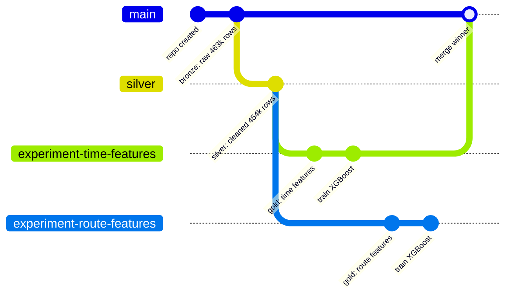

# Flight Delay Prediction with CBorg Studio, lakeFS & AI

From spec to trained model in one session

  LBNL / CBorg Studio

<!--
Welcome. Today I'll walk through a demo project: predicting US domestic flight delays.
The interesting part isn't the model — it's how AI and data versioning change the workflow.
-->

---
transition: fade-out
---

# The Challenge & The Toolkit

**Can we predict whether a flight will be delayed >15 minutes?**

- 454k flights, 2023 US domestic data, XGBoost binary classifier
- Real question for this talk: **how do AI + data versioning change the data science workflow?**

### CBorg Studio
- JupyterHub + **OpenCode** (AI coding agent)
- MCP tool integrations (search, journal, GitHub)
- Multiple models: Open weight (on prem), Commercial Cloud Providers (AWS/GCP/OpenAI/Grok)  
- Models provided to users via a middleware layer (LiteLLM),  

### lakeFS
- **Git-like branching and commits for data**
- Every data state is versioned, addressable, auditable
- Branch per experiment, merge the winner

<!-- TODO: Replace with architecture diagram showing JupyterHub + OpenCode + lakeFS + MCP connectors -->

<!--
CBorg Studio gives us a JupyterHub environment with an embedded AI coding agent.
lakeFS gives us Git for data — branches, commits, merges, all for Parquet files.
-->

---
layout: two-cols-header
---

# Start with a Spec, Let AI Plan

AI reads the project spec, proposes technology choices, and asks clarifying questions — *before writing any code*.

::left::

AI reading spec.md, proposing Python 3.11, Parquet, XGBoost, lakeFS SDK

::right::

AI presents encoding tradeoffs; user selects "1 please"

<!--
The AI doesn't just execute blindly. It reads the spec, proposes a tech stack, then asks structured
questions about tradeoffs — like which encoding strategy to use — and waits for your decision.
-->

---
layout: two-cols-header
---

# Todo-Driven Execution with Memory

Plan becomes a checklist. AI picks the next task, implements with TDD, checks it off — and **remembers across sessions**.

::left::

AI consults its journal before starting work

::right::

After completing tasks, AI records learnings back to journal

<!--
The AI has a private journal — an MCP tool. Before each task it reads past entries for context.
After completing work, it writes back what it learned. This gives it continuity across sessions.
It's not a blank slate every time.
-->

---

# Medallion Architecture on lakeFS Branches

Each data layer is a **lakeFS branch + commit** — versioned, reproducible, auditable.

- **Bronze** (main): 463k raw rows as Parquet
- **Silver** (branch): cleaned to 454k, binary target `is_delayed = arrival_delay > 15`
- Temporal train/test split: Jan–Jun train, Jul–Aug test — *recommended by AI* to avoid data leakage

<!-- TODO: Add lakeFS UI screenshot showing branch list for flight-delay-demo -->

<!--
We map the medallion architecture directly onto lakeFS branches.
Bronze is raw data on main. Silver branches off, cleans, creates the target variable.
Then each experiment gets its own branch from silver. The winner merges back to main.
The AI actually recommended the temporal split — it deviated from the spec to avoid future-data leakage.
-->

---

# EDA: What Does the Data Look Like?

Frontier, JetBlue, Spirit lead in average delays

DEN-ABE route averages 1,000+ min delay

  
78%

  
On-time

  
22%

  
Delayed

  
Train: 21.5% delayed

  
Test: 24.5% delayed

  
Seasonal shift the temporal split reveals

<!-- TODO: Add delay distribution histogram with 15-min threshold line (from notebook 01 section 1.3) -->

<!--
Key EDA findings: the dataset is imbalanced — 78% on-time, 22% delayed.
Certain airlines and routes are far worse than average.
The temporal split shows a seasonal shift in delay rates between train and test sets,
which is exactly the kind of thing you'd miss with a random split.
-->

---

# Branching for Experiments: Head-to-Head

### Experiment A: Time Features
Branch `experiment-time-features`

- hour, day_of_week, month, is_weekend, time_of_day_bucket
- \+ airline, origin, distance
- Label encoding

### Experiment B: Route Features
Branch `experiment-route-features`

- Frequency encoding for 348 origins, 6,088 routes
- Leakage-safe delay rates (training split only)
- Global-rate fallback for unseen categories

| Metric | Exp A (Time) | Exp B (Route) | Winner |
|--------|:-----------:|:------------:|:------:|
| F1     | **0.371**   | 0.030        | A      |
| AUC-PR | **0.495**   | 0.310        | A      |
| Recall | **0.276**   | 0.016        | A      |

Winner merged to `main`. Losing branch preserved — you can always go back and inspect it.

<!-- TODO: Add overlay PR curve from notebook 02 section 2.4 -->
<!-- TODO: Add lakeFS UI screenshot showing main branch commit history after merge -->

<!--
Each experiment gets its own branch from silver. Experiment A uses time-based features,
Experiment B uses route-based features with frequency encoding.
Time features win decisively across every metric. Route features alone produce near-zero recall.
We merge the winner back to main — the losing branch stays around for inspection.
-->

---
layout: two-cols-header
---

# AI That Debugs and Tests with Discipline

::left::

### Transparent Debugging

- lakeFS server unreachable
- AI reported **exactly** what it tried: curl, SDK, integration test
- Clearly stated what it did **not** try
- No hallucination, no silent failures

::right::

### TDD Discipline

- Every phase: write failing test, implement, green, commit
- Subagent sessions handle tasks autonomously
- Reports back with diffs and status

<!--
Two things that set this apart from typical AI code generation.
First: when something breaks, the AI doesn't hallucinate a fix. It reports structured debugging output
showing exactly what it tried, what worked, what didn't, and where it got stuck.
Second: it follows TDD discipline. Write a failing test first, implement until green, commit.
-->

---

# Key Takeaways

<v-clicks>

  
1.

  
<strong>lakeFS branches replace ad-hoc experiment tracking</strong> — every data state is a versioned, addressable snapshot

  
2.

  
<strong>AI doesn't just generate code</strong> — it plans, asks questions, tracks progress, writes tests, and debugs transparently

  
3.

  
<strong>Medallion architecture maps cleanly to lakeFS</strong> — bronze / silver / gold as branch + commit boundaries

  
4.

  
<strong>MCP integrations extend AI capabilities</strong> — search, journal, GitHub are tools the AI uses autonomously

  
5.

  
<strong>Multiple models, one interface</strong> — pick GPT-5.3 Codex for speed or Claude Opus 4 for reasoning

</v-clicks>

<!--
Five things to take away.
lakeFS gives you Git for data — no more ad-hoc experiment tracking.
The AI agent is more than a code generator — it plans, collaborates, tests, and debugs.
Medallion architecture maps naturally onto lakeFS branches.
MCP integrations let the AI use external tools autonomously.
And you can pick the right model for the job.
-->

---
layout: center
class: text-center
---

# Questions?

CBorg Studio &middot; lakeFS &middot; OpenCode

<!-- TODO: Add contact info, links to lakeFS docs, CBorg Studio -->

<!--
Happy to take questions.
-->
