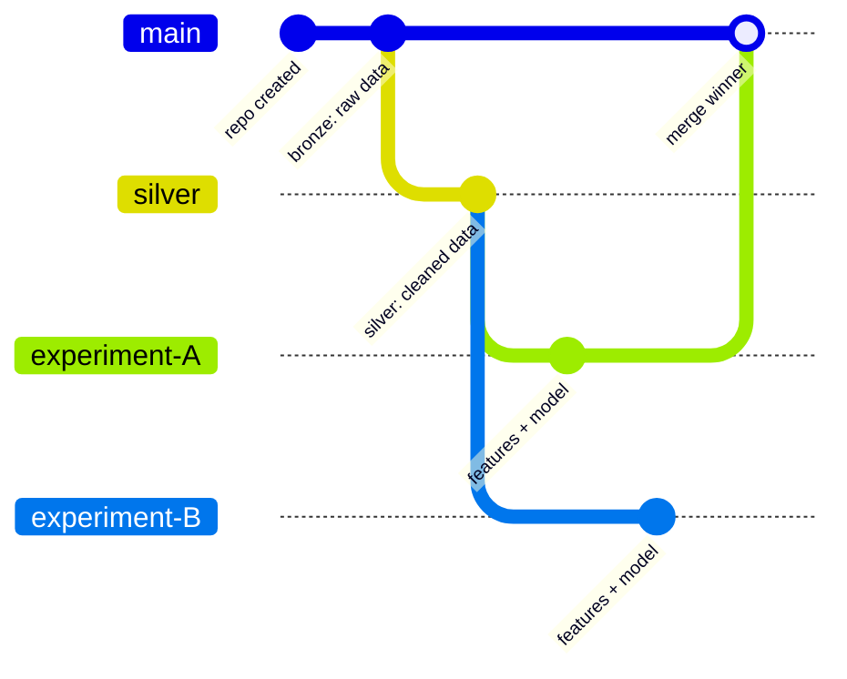
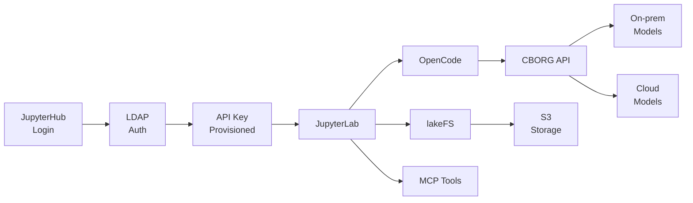

<div class="absolute inset-0 bg-[#4198B5]"></div>

<div class="absolute top-6 left-8">
  
</div>

<div class="absolute top-6 right-8">
  
</div>

<div class="absolute inset-0 flex flex-col items-center justify-center text-white pt-8">
  <h1 class="!text-5xl !text-white font-bold text-center leading-tight !border-none">CBorg Studio</h1>
  <p class="text-xl mt-4 text-center">An AI-Ready Data Science Environment<br/>for Scientific Programming</p>
  <div class="mt-16 text-base opacity-90 text-center">
    Tim Fong and Andrew Schmeder
  </div>
  <div class="mt-2 text-sm opacity-75 text-center">
    ScienceIT Department, Lawrence Berkeley National Laboratory, California USA
  </div>
</div>

<!--
Welcome. Today I'm going to introduce CBorg Studio — an integrated AI-ready data science
environment we've built at Berkeley Lab. I'll walk through what it is, what's in it,
and then show a real project that was built entirely inside the environment.
-->

---
transition: fade-out
---

# The Scientific Programming Gap

Scientists need compute, AI models, data versioning, and coding tools — but they arrive as **disconnected pieces**.

<div class="grid grid-cols-2 gap-8 mt-8">
<div>

### The friction today
- Get an API key for model access
- Configure a development environment
- Set up data version control
- Choose and connect to AI models
- Manage credentials and budgets

</div>
<div>

### What if instead...
- You log in and **everything is already there**?
- API key provisioned automatically
- AI coding agent pre-configured
- Data versioning connected
- Multiple models available through one endpoint

</div>
</div>

<!--
Scientists are not DevOps engineers. Every tool they have to configure is a barrier
before the real work starts. The gap is integration.
-->

---

# CBorg Studio: What You Get When You Log In

<div class="grid grid-cols-2 gap-6 mt-4">
<div>

### Compute
- **JupyterLab** — primary notebook environment
- VS Code available via JupyterHub launcher

### AI-Ready Development
- **OpenCode** — AI coding agent, embedded
- Preloaded prompts and workflows
- Framework for introducing new coding agents

</div>
<div>

### Data
- **lakeFS** — Git-like version control for datasets
- Branches, commits, merges for data files
- Web-based data browser

### CBORG API
- **LiteLLM gateway** (budget enforcement) — one endpoint, many models
- On-prem open-weight + commercial cloud
- LDAP-provisioned API key with budget controls

</div>
</div>

<!-- TODO: Replace with architecture diagram showing JupyterHub + OpenCode + lakeFS + CBORG API -->

<!--
This is what a user sees when they log in. JupyterHub is the front door.
JupyterLab launches with OpenCode already embedded, lakeFS already connected,
and a CBORG API key already provisioned. No setup required.
VS Code is available via the launcher — it's there but not yet the primary workflow.
-->

---

# CBORG API: One Key, Many Models

<div class="grid grid-cols-2 gap-8 mt-4">
<div>

### Architecture
- **LiteLLM gateway** — single API endpoint
- Routes requests to the right backend model
- LDAP authentication provisions an ephemeral API key at login
- Per-user budget controls prevent runaway costs

</div>
<div>

### Available Models

**On-prem open-weight** — data stays at the lab

**Commercial cloud** — frontier capabilities

Users don't manage credentials — the key is injected into the environment at login.

</div>
</div>

<!-- TODO: Add diagram showing LDAP → API key → LiteLLM → model backends -->

<!--
The CBORG API is the backbone that enables everything else. It's a LiteLLM instance
that acts as a gateway to both on-prem open-weight models and commercial cloud providers.
Users get an API key automatically through LDAP authentication — they log in and it's there.
Budget controls are per-user so costs don't run away.
The on-prem option matters for data sensitivity or researchers with severe budget constraints.
-->

---

# lakeFS: Git for Data

Branches, commits, merges — but for **datasets**, not source code.

<div class="grid grid-cols-2 gap-8 mt-4">
<div>

- S3-compatible storage backends (on-prem and cloud)
- Every data state is versioned, addressable, auditable
- Branch per experiment, merge the winner
- Losing branches preserved for inspection
- Accessible from notebooks via Python SDK

</div>
<div>



</div>
</div>

<!--
lakeFS gives data the same version control discipline as code.
You can branch to try an experiment, and if it doesn't work out, the main branch is untouched.
The diagram shows the pattern we'll see in the demo: raw data on main, cleaned data on a silver branch,
and experiment branches that compete. The winner merges back to main.
-->

---

# lakeFS in Practice

<div class="flex justify-center mt-8">

</div>

<p class="text-center text-sm opacity-60 mt-4">lakeFS UI: branch list for the flight-delay-demo repository — main, silver, experiment-time-features, experiment-route-features</p>

<!--
Here's the actual lakeFS web UI for our demo repository.
You can see the four branches: main for bronze data, silver for the cleaned dataset,
and two experiment branches — one for time-based features, one for route-based features.
This is the branching pattern from the previous diagram, running in production.
-->

---

# OpenCode: The AI Coding Agent

<div class="grid grid-cols-2 gap-8 mt-4">
<div>

### Capabilities
- Plans projects from specs before writing code
- Presents tradeoffs, waits for user decisions
- Follows TDD — failing tests first, then implementation
- Transparent debugging — reports what it tried and what it didn't

### MCP Tool Integrations
- DuckDuckGo search, private-journal
- Tools the AI uses autonomously to extend its capabilities

</div>
<div>

### Preloaded Workflows
- `/plan`, `/do-todo`, `/brainstorm`
- Based on [Superpowers](https://github.com/obra/superpowers) repo
- Framework for introducing new coding agents as they emerge

### Extensibility
- New agents arrive monthly — the environment adapts
- Learning integration via fork of [learning-opportunities](https://github.com/DrCatHicks/learning-opportunities)

</div>
</div>

<!--
OpenCode is not just a code generator. It has a planning mode, a decision-making mode,
and an execution mode. It uses MCP tools — search, private journal — to extend its
capabilities autonomously. The preloaded prompts encode best practices for scientific
programming workflows. And as new coding agents come out, the framework lets us
introduce them without rebuilding the environment.
-->

---

# OpenCode: Learning Integration

The AI generates interactive quizzes from the codebase — helping users **learn as they go**, not just let the model do it all.

<div class="grid grid-cols-3 gap-4 mt-6">

<div>

<p class="text-xs opacity-60 mt-2">Subagent explores the repo and picks a topic</p>
</div>

<div>

<p class="text-xs opacity-60 mt-2">Quiz with progressive difficulty</p>
</div>

<div>

<p class="text-xs opacity-60 mt-2">Answer key and hands-on mini-exercise</p>
</div>

</div>

<!--
The learning skill gives users the ability to learn as they go. The AI explores the codebase,
picks a meaningful topic, and generates a quiz with progressive difficulty.
It includes an answer key and a practical mini-exercise.

Agentic coding is still new, many of us are still searching for ways to keep learning even as we accelerate development.
-->

---
layout: two-cols-header
---

# Demo: AI Plans, Then Asks Before Acting

A real project built entirely inside CBorg Studio: predicting US domestic flight delays (454k flights, 2023 data, XGBoost).

::left::


<p class="text-xs opacity-60 mt-1">AI reads the spec, proposes Python 3.11, Parquet, XGBoost, lakeFS SDK</p>

::right::


<p class="text-xs opacity-60 mt-1">At a design decision, AI presents structured tradeoffs and waits: "1 please"</p>

<!--
This entire project was built inside CBorg Studio. The AI reads the project spec,
proposes a technology stack, and identifies risks. When it encounters a design decision —
like which encoding strategy to use for categorical variables — it doesn't guess.
It presents a structured comparison with pros and cons and waits for the user to decide.
-->

---
layout: two-cols-header
---

# Demo: Persistent Memory Across Sessions

The AI has a [private journal](https://github.com/obra/private-journal-mcp) (MCP server). It reads before acting and writes after completing — **not a blank slate every time**.

::left::


<p class="text-xs opacity-60 mt-1">Before starting work: AI consults its journal for context from earlier sessions</p>

::right::


<p class="text-xs opacity-60 mt-1">After completing work: AI records project notes, technical insights, user preferences</p>

<!--
This is agentic memory — an experimental capability. The plan becomes a todo list.
The AI picks the next task, implements with TDD, checks it off.
But before starting, it reads its private journal for context from earlier sessions.
After completing, it writes back what it learned — project notes, technical insights,
observations about user preferences. This gives it continuity across sessions.
If you start a new conversation tomorrow, the AI has context from today. Also helps if there is an interruption to the session, it's a place to restart. 
-->

---

# Demo: Data Pipeline on lakeFS

Medallion architecture mapped directly onto lakeFS branches.

<div class="grid grid-cols-3 gap-4 mt-4">
<div class="col-span-1">

### Pipeline
- **Bronze** (main): 463k raw rows
- **Silver** (branch): cleaned to 454k rows
- **Gold** (experiment branches): features + models

</div>
<div class="col-span-1">


<p class="text-xs opacity-60 mt-1">Delay patterns by airline</p>

</div>
<div class="col-span-1">


<p class="text-xs opacity-60 mt-1">Most delayed routes</p>

</div>
</div>

<div class="mt-4 grid grid-cols-3 gap-4 text-center text-sm">

<div class="bg-[#007681]/10 rounded p-2">78% on-time</div>
<div class="bg-[#D57800]/10 rounded p-2">22% delayed</div>
<div class="bg-[#B1B3B3]/15 rounded p-2">Final model temporal split: train delay 21.5% · test delay 24.5%</div>

</div>

<!--
This is lakeFS in action. The medallion architecture maps directly onto branches.
Bronze data goes on main. Silver branches off for cleaning — dropping cancelled flights,
creating the binary target variable. Each experiment gets its own branch from silver.
While building the demo I realized I needed a temporal train/test split. So I altered the specit read the spec, and the tool proposed a fix.  78% on-time, 22% delayed, with a seasonal shift between train and test sets.
-->

---

# Demo: Branch, Experiment, Compare, Merge

Each experiment gets its own lakeFS branch. Compare metrics. Merge the winner. Keep the losers.

<div class="grid grid-cols-2 gap-8 mt-4">
<div>


<div class="mt-4 text-sm">

Winner merged to `main` — full lineage preserved in commit log.

Easy to iterate from here, just go back to the silver branch and generate new feature engineering etc.
</div>

</div>
<div>


### The commit log tells the data story

```
ac1f7b57  Repository created
ce974476  Bronze: raw flight data
54d9600d  Silver: cleaned, delay target
6a93a745  Gold: time-based features
4bc1c7e4  Train XGBoost, save metrics
89c1b6e8  Merge winner to main
```

<div class="text-sm mt-2 opacity-70">

Losing branch preserved for inspection.

</div>

</div>
</div>

<!-- TODO: Add lakeFS UI screenshot showing main branch commit history after merge -->

<!--
Each experiment gets its own branch, its own gold-layer artifacts, its own trained model.
Comparison happens by loading metrics from both branches. Time features win decisively.
The winner merges back to main. The commit log on main now tells the full data story —
from raw ingest to trained model. The losing experiment branch stays around — you can
always go back. The entire pipeline was driven by the AI agent working through a todo list.

F1 = 2 * (precision * recall) / (precision + recall)
This means if either precision or recall is very low it penalizes the average significantly.

Precision: Of all the flights the model labeled as delayed, what fraction actually were delayed? It measures how much you can trust a positive prediction.

Recall: Of all the flights that actually were delayed, what fraction did the model catch? It measures how thorough the model is at finding the positives.
-->

---
layout: two-cols-header
---

# Demo: Transparent Debugging and TDD

::left::

### When things break

- lakeFS server became unreachable
- AI reported **exactly** what it tried: curl, SDK, integration test
- Clearly stated what it did **not** try
- *"I lack the information to diagnose further"*
- No hallucination, no silent failures


::right::

### Engineering discipline

- Every phase: write failing test → implement → green → commit
- Subagent sessions handle tasks autonomously
- Reports back with diffs, GitHub issues, status


<!--
Two behaviors that distinguish this from typical AI code generation.
First: when something breaks, the AI doesn't hallucinate a fix. It reports structured
debugging output. Here the lakeFS server was unreachable. The AI tried three methods
and clearly stated where it got stuck.
Second: the AI follows TDD discipline. Failing test first, then implementation until green,
then commit. Subagent sessions handle tasks autonomously and report back.
-->

---

# Experimental AI-First Capabilities

CBorg Studio is also an experimental platform for developing and testing AI-first scientific programming tools.

<div class="grid grid-cols-3 gap-6 mt-6">

<div class="bg-[#007681]/10 rounded p-4">

### Agentic Memory
Private journal gives AI continuity across sessions. Reads context before acting, records learnings after completing.

<div class="text-xs opacity-60 mt-2">Demonstrated in slide 8</div>

</div>

<div class="bg-[#74AA50]/10 rounded p-4">

### Data Version Control
lakeFS branches as experiment isolation and lineage tracking. Commit log becomes the audit trail.

<div class="text-xs opacity-60 mt-2">Demonstrated in slides 9–10</div>

</div>

<div class="bg-[#D57800]/10 rounded p-4">

### Workflow Orchestration
Todo-driven execution with subagent delegation. AI plans, implements, and tracks progress autonomously.

<div class="text-xs opacity-60 mt-2">Demonstrated in slides 8, 11</div>

</div>

</div>

<div class="mt-6 text-sm text-center opacity-70">

**Next:** agent-to-agent collaboration · cross-project memory · richer introspection

</div>

<!--
These are the experimental capabilities we're actively developing.
Agentic memory, data version control integration, and workflow orchestration are all
working today — you just saw them in the demo. What's next: we're exploring
agent-to-agent collaboration (openclaw), cross-project memory so the AI can apply lessons
from one project to another, and richer introspection into AI decision-making.
-->

---

# The Integrated Stack

Everything demonstrated today was built inside CBorg Studio — **no external setup required**.

<div class="mt-4">



</div>

<div class="mt-2 text-center text-sm opacity-70">

Integration eliminates friction. The individual tools exist elsewhere — the value is having them work together out of the box.

</div>

<!--
Bring it back to the platform message. Everything we showed — the planning, the data pipeline,
the experiments, the debugging, the memory — happened inside CBorg Studio.
The user didn't install anything. The API key was already there. The lakeFS connection
was already configured. The AI tools were already loaded.
That's the point: integration eliminates friction.
-->

---

# Key Takeaways

<div class="grid grid-cols-1 gap-4 mt-6">

<v-clicks>

<div class="flex items-start gap-3">
  <div class="text-2xl">1.</div>
  <div><strong>Zero-friction AI access</strong> — LDAP login gives you an API key, a coding agent, and connected tools. No setup.</div>
</div>

<div class="flex items-start gap-3">
  <div class="text-2xl">2.</div>
  <div><strong>Data version control changes experimentation</strong> — lakeFS branches isolate experiments; the commit log is the audit trail.</div>
</div>

<div class="flex items-start gap-3">
  <div class="text-2xl">3.</div>
  <div><strong>AI agents follow engineering discipline</strong> — planning, TDD, transparent debugging, persistent memory.</div>
</div>

<div class="flex items-start gap-3">
  <div class="text-2xl">4.</div>
  <div><strong>Integration is the product</strong> — the individual tools exist elsewhere. The value is having them work together out of the box.</div>
</div>

<div class="flex items-start gap-3">
  <div class="text-2xl">5.</div>
  <div><strong>Experimental capabilities are shipping</strong> — agentic memory, data version control, workflow orchestration. All working today.</div>
</div>

</v-clicks>

</div>

<!--
Five things to take away.
Log in and go.
Data versioning changes how you think about experimentation.
In this case, this took shape over a day or two of work while jetlagged, and would be a good start for further iteration
The data versioning combined with agentic coding accelerates the speed of iteration.
Futher work -- setting up separate agent instance for judging the output of code. 
-->

---
---

# Links

Resources referenced in this presentation:

- Superpowers: https://github.com/obra/superpowers — *OpenCode: The AI Coding Agent*
- learning-opportunities: https://github.com/DrCatHicks/learning-opportunities) — *OpenCode: The AI Coding Agent*
- private-journal-mcp: https://github.com/obra/private-journal-mcp  — *Demo: Persistent Memory Across Sessions*

---
layout: center
class: text-center
---

# Questions?

<div class="mt-4 flex justify-center items-center gap-8">
  
  
</div>

<div class="mt-4 text-lg">

CBorg Studio · lakeFS · OpenCode

</div>

<div class="mt-6 text-sm opacity-80">

Tim Fong — [tyfong@lbl.gov](mailto:tyfong@lbl.gov)

Andrew Schmeder — [awschmeder@lbl.gov](mailto:awschmeder@lbl.gov)

</div>

<!--
Thank you. Happy to take questions — and happy to show any of the screenshots
in more detail if you'd like a closer look.
-->
